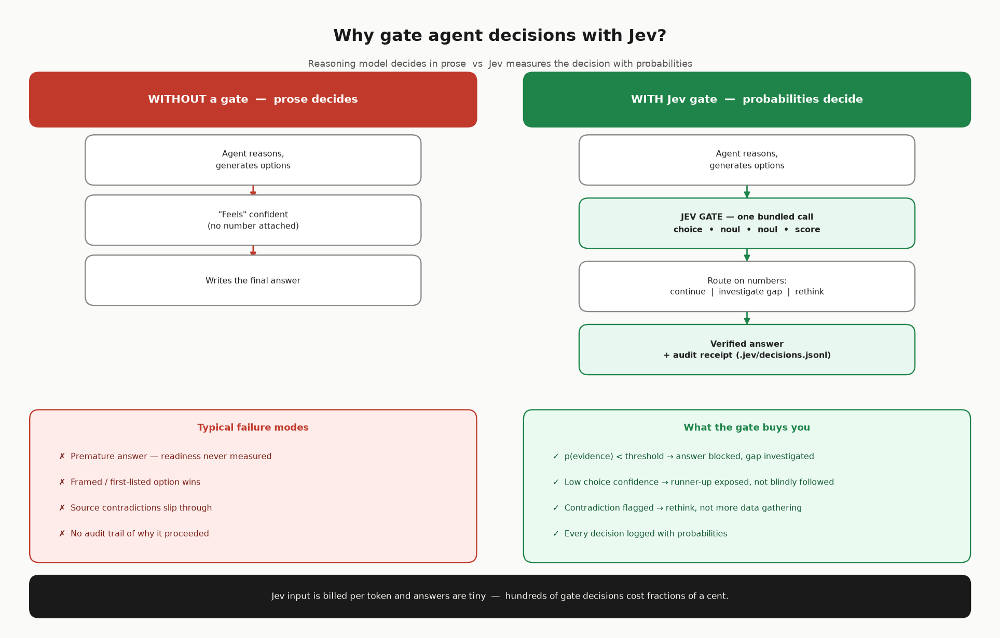

# Jev Decision Gate Skill for Hermes Agent



A [Hermes Agent](https://hermes-agent.nousresearch.com) skill + helper client for **Jev** (`typesafe/jev-1.13`), a *decisions model* served through OpenRouter's alpha API. This repo gives Hermes (or any Python agent) a clean way to use Jev as a **decision gate** between reasoning steps.

---

## What is Jev?

Most LLMs are **reasoning models**: you give them text, they write text back. Useful, but when you ask them *"which option is better?"* or *"is the evidence good enough to proceed?"*, the answer comes back as prose — confident-sounding, hard to score, and easy to fool with framing.

**Jev is the opposite.** It is a decisions model:

- **No text in, no text out.** You send structured JSON state; it returns typed answers with **calibrated probabilities**. It never writes deliverables, never "explains itself", never hallucinates a report.
- **Answers pre-defined typed questions** in three kinds:
  - **`choice`** — pick one alternative from a candidate list → returns the winner + full probability distribution (`"payments": 0.95, "frontend": 0.05`)
  - **`noul`** — a yes/no gate ("is evidence sufficient?") → returns P(yes) as a number (e.g. `0.96`)
  - **`score`** — position on an anchored scale → weighted score + per-anchor probabilities
- **One call, many questions.** A single request can bundle 4+ questions — cheap in both latency and tokens.

The division of labor: **Jev owns decision probabilities; the reasoning model owns everything else.** The agent reasons, generates alternatives, writes. Jev gates *between* steps.

```
Endpoint:  POST https://openrouter.ai/api/alpha/decisions
Model:     typesafe/jev-1.13
Auth:      OpenRouter API key (same one as reasoning models)

⚠️  This is NOT /chat/completions — sending it there simply fails.
```

---

## Why a decision gate helps

Agent pipelines fail in predictable ways, and a probability gate fixes each one:

| Failure mode without a gate | With a Jev gate |
|---|---|
| Agent *feels* the evidence is enough and writes the answer | `noul` gate: if P(evidence adequate) < threshold → **don't write the answer**, investigate the named gap first |
| Agent picks a strategy because it was listed first / sounded confident | `choice` returns a real distribution — if confidence < 0.5, expose the runner-up instead of blindly following |
| Two sources disagree but the contradiction is never noticed | `noul` gate: "is there a material contradiction?" — route to *rethink* rather than *gather more data* (contradictions outrank gaps) |
| Every step "decides" inside a wall of prose | Every decision is a typed answer with a number — and a **receipt logged to `.jev/decisions.jsonl`** (timestamp, state hash, answers, confidences) for audit |

In short: Jev turns *"I think we should proceed"* into `p_yes = 0.42` → **stop and investigate**. It's the difference between an agent that *sounds* decided and one that *measures* its own decision-readiness.

---

## What's in this repo

```
jev/
├── SKILL.md            # The Hermes skill: contract, workflow, verified response schema, pitfalls
└── scripts/
    └── jev_client.py   # Helper client — always use this, never hand-roll requests
```

### The helper client

```python
import sys; sys.path.insert(0, r"<path-to>/jev/scripts")
from jev_client import jev_decide, jev_choice, jev_gate, jev_case_state
```

| Helper | Purpose |
|---|---|
| `jev_decide(state, questions)` | Raw bundled call → answers dict |
| `jev_choice(state, question, options, ...)` | Winner + full probability distribution |
| `jev_gate(state, question, ..., threshold=0.7)` | `(passed: bool, p_yes: float)` |
| `jev_case_state(...)` | The 4-question CASE STATE bundle (choice + 2 yes/no + score) — one request |
| `jev_prioritize(state, question, items, ...)` | **Many candidates** (100 features/ideas/risks/leads): tournament over heats of ≤8 options with a wild-card runner-up; auditable round log |
| `jev_triage(state, item, context, ...)` | **ignore / investigate / escalate** routing for exceptions, risks, cases — low confidence degrades to `investigate`, never silently ignores |
| `jev_route(state, query, agents, ...)` | **Agent orchestration**: which agent handles a query; below the confidence threshold it falls back to `human` |

Key resolution: `$OPENROUTER_API_KEY` env → Windows `HKCU\Environment` registry (works right after `setx`, no restart needed).

Self-test: `python scripts/jev_client.py --selftest`

---

## The decision-gate loop

```
Agent reasons → generates hypotheses/alternatives → gathers evidence
  → JEV GATE (one bundled call):
      choice : which next investigation / which alternative wins
      noul   : is evidence adequate?
      noul   : is there a material contradiction?
      score  : how decision-ready is the case?
  → route on answers:  continue | investigate gap | rethink hypothesis
  → Agent analyzes/simulates
  → JEV CHALLENGE GATE (noul: does the fact base support the draft conclusion?)
  → Agent synthesizes final answer
```

Gate rules:
- P(evidence-adequate) < threshold → **do not** write the answer; investigate the named gap
- Choice confidence < 0.5 → present the next-best option, don't blindly follow
- Contradiction ≥ threshold → `rethink_hypothesis` (more evidence is the wrong remedy when sources conflict)
- Every call appends an audit receipt to `.jev/decisions.jsonl`

---

## Real applications

| Workflow | Jev question | Type |
|---|---|---|
| Business case competitions | pick strongest strategy alternative under stated criteria | choice |
| Fact-base verification | does evidence support this claim before it enters a deck | noul gate |
| Multi-agent consensus | score/rank agent proposals before full deliberation | choice + score |
| Experiment selection | which hypothesis merits testing next | score |
| Deck QA | is this section consistent with the fact base | noul |

---

## The Universal Jev Pattern

Almost every enterprise use case reduces to the same flow:

```
INPUT STATE
   ↓
LLM generates: options / hypotheses / possible actions
   ↓
Analytics evaluates: numbers, constraints, scenarios
   ↓
JEV DECIDES: "What deserves attention?"
   ↓
LLM continues reasoning
   ↓
Action / recommendation
```

LLM = thinks and creates options. Analytics = calculates. **Jev = decides which direction deserves attention.** The opportunity is not Jev replacing managers — it is Jev becoming the **decision-control layer inside AI agents making business decisions**.

## Enterprise use-case catalog (ranked by value)

| Rank | Area | Example Jev question | Helper |
|---|---|---|---|
| 1 | AI agent orchestration | which agent handles this query? (billing / support / human) | `jev_route` |
| 2 | Product management | which feature / experiment enters the next sprint? | `jev_prioritize` |
| 3 | Supply chain / S&OP | which plan deserves simulation? (inventory / production / promo / outsource) | `jev_choice` |
| 4 | FMCG innovation | which concept deserves consumer testing first? | `jev_prioritize` |
| 5 | Consulting case solving | which hypothesis should be tested first? | `jev_case_state` |
| 6 | Project management | which risks need immediate attention? (ignore / investigate / escalate) | `jev_triage` |
| 7 | Sales | which leads deserve sales attention? | `jev_prioritize` |
| 8 | Finance | which acquisition targets deserve due diligence? | `jev_prioritize` |
| 9 | HR | which retention / recruitment cases need intervention? (human oversight) | `jev_triage` |
| 10 | Marketing | which campaign deserves A/B testing? | `jev_choice` |

---

## Hard-won pitfalls (from live calls — documented so you don't repeat them)

1. **Contradiction detection needs labels.** Bare facts ("source A: 12%", "source B: 18%") score LOW (~0.27) on material-contradiction — Jev does not infer that two numbers disagree. Write the conflict *explicitly* in the state: `"conflict": "Source A says 12%, source B says 18% — unreconciled"`. Otherwise the gate silently passes.
2. **`score` is a weighted position, not an index.** Readiness of 0.45 on a 0–2 legend means "mostly not ready", not "level 0.45".
3. **Response keys are named by question type** (`noul`, `choice`, `score`), not generic names. Reading the wrong key silently yields `0.0`/`None` — the client's extractors handle all shapes.
4. **Bundle questions.** The 4-question CASE STATE costs one request; splitting it into 4 calls wastes 4×.
5. **Keep `state` compact.** Input is billed per token — send facts, not prose dumps. Never put secrets in state.

---

## Setup

1. Set `OPENROUTER_API_KEY` (env var, or `setx` on Windows — the client reads the registry too).
2. Copy the `jev/` folder into Hermes' skills directory (or any Python project path).
3. In Hermes: triggers like *"jev"*, *"decision gate"*, *"which alternative"*, *"is evidence sufficient"*, *"decision-ready"* activate the skill.
4. Sanity-check with `python scripts/jev_client.py --selftest`.

## Cost

Jev input is billed per token and answers are tiny — hundreds of gate decisions cost **fractions of a cent**. The expensive resource it saves is your reasoning model's attention (and your patience).
